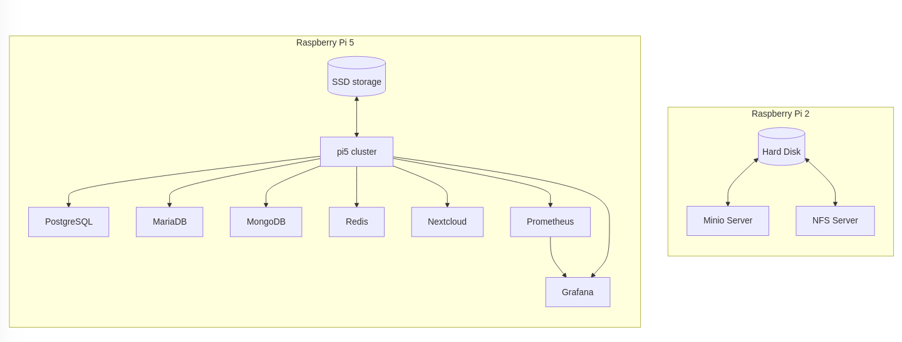
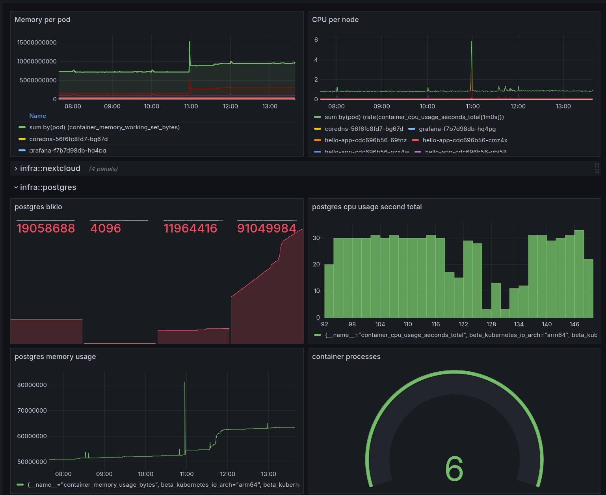
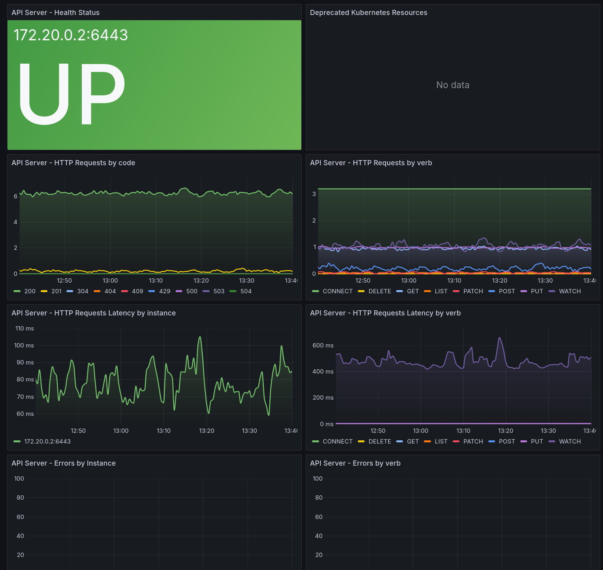

# Cloud home lab setup

## Hardware

1. 2TB hard disk
2. raspberry pi 2 (4GB)
3. SSD
4. raspbery pi 5 (8GB))

## Software

1. docker / docker-compose
2. kubernetes (k3d)
3. minio
4. NFS
5. Samba
6. Nextcloud
7. Postgresql
8. MongoDB
9. Mongo Express
10. MariaDB
11. Redis
12. Prometheus
13. Grafana

## System structure

1. Attach the hard disk (2TB) to raspberry pi 2, and install
   minio
   NFS
   Samba
2. Attach the SSD to raspberry pi 5 (8GB), and install
   Nextcloud
   Postgresql
   MongoDB/MongoExpress
   MariaDB
   Redis
   Prometheus
   Grafana

